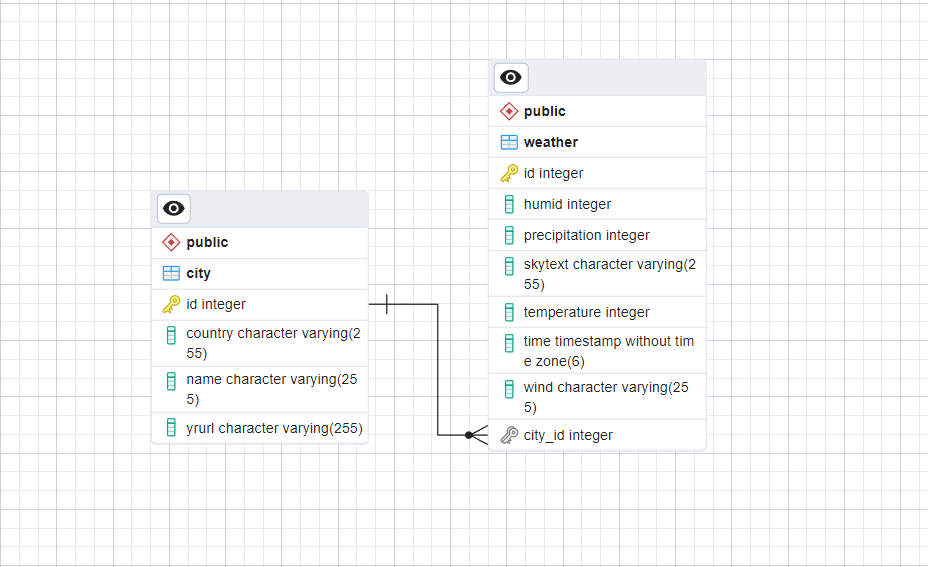

[java]: https://img.shields.io/badge/java-v17-blue
[gson]: https://img.shields.io/badge/gson-v2.10.1-blue
[okhttp]: https://img.shields.io/badge/okhttp-v4.2.2-blue
[jsoup]: https://img.shields.io/badge/jsoup-v1.16.1-blue
[postgresql]: https://img.shields.io/badge/postgresql-v42.6.0-blue
[hibernate]: https://img.shields.io/badge/hibernate--core-v6.2.4.Final-blue
[lombok]: https://img.shields.io/badge/lombok-v1.18.28-blue
[junit-jupiter]: https://img.shields.io/badge/junit-v5.9.1-blue

    <h1>Dat3-SP2</h1>
    <h2>Weather Data Enrichment and Storage</h2>

    

[![java][]]() 
[![gson][]]()
[![okhttp][]]()
[![jsoup][]]()
[![postgresql][]]()
[![hibernate][]]()
[![lombok][]]()
[![junit-jupiter][]]()

### Group:
* Sebastian Klitte Egeberg - Github: **[Sebbedeb](https://github.com/Sebbedeb)**
* Lasse Baggesgård Hansen - Github: **[kotteletfisk](https://github.com/kotteletfisk)**
* Oskar Daniel Olsen - Github: **[cph-oo221](https://github.com/cph-oo221)**

### Business model:
xxx

### EER Diagram:

### API(s):
API: https://vejr.eu/pages/api-documentation

### Scraping:
Hjemmeside: https://www.yr.no/nb